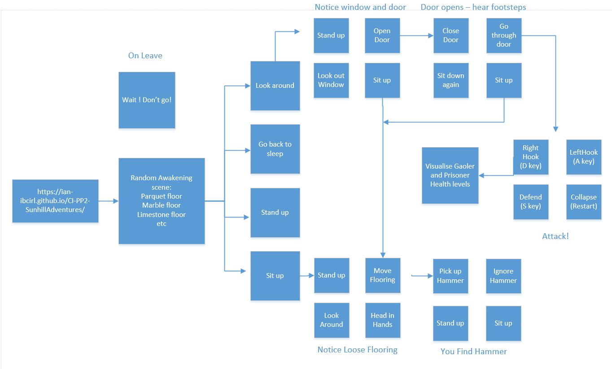
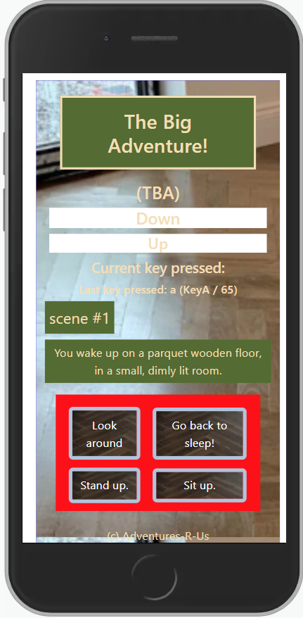
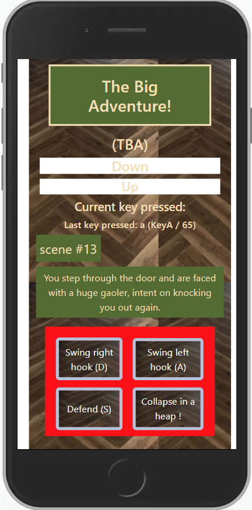

## About my project
## Code Institute Portfolio Project 2 covering Javascript, HTML and CSS 

<h1 align="center">Sunhill Adventures Website</h1>

Welcome to my repository for PP2.

This project is deployed at: https://ian-ibcirl.github.io/CI-PP2-SunhillAdventures/ 

The last update to this file was: **September 15th, 2022**

## Gitpod Reminders

To run a frontend (HTML, CSS, Javascript only) application in Gitpod, in the terminal, type:

`python3 -m http.server`

------

## Index
* [User Experience (UX)](#user-experience-ux) 
* [Features](#features)
* [Design](#design)
* [Technologies Used](#technologies-used)
* [Testing](#testing)
* [Deployment](#deployment)
* [Gitpod Reminders](#gitpod-reminders)
* [Credits](#credits)
* [Release History ](#release-history) 

## Project Goals

My goals have been to:
1) develop a website which 
2) enables me to demonstrate newly learned javascript skills, 
3) courtesy of the Code Institute (codeinstitute.com). 
4) Following initial review of recommended options, 
5) I began researching financial charting of securities, and 
6) simple text based adventure gaming web development. 
7) I found https://www.youtube.com/watch?v=R1S_NhKkvGA which 
8) looks like the right way to go,
9) so I have developed my game on that basis, and extended the features.
10) utilising Javascript, HTML and CSS, with 
11) Bootstrap's powerful, feature-packed frontend toolkit.

### Project Additional Goals

12) I have decided to add a keyboard fight sequence at the end of the game
13) so i will create the player (adding the option to name the player) and enemy (gaoler)
14) I will move player and enemy with event listeners for arrow keys
15) add attacking keys ASD
16) add health bar
17) game timers and game over

------

## User Experience (UX)

-   ### User stories

    -   #### A. First Time Visitor Goals

            1. As a First Time Visitor, I want to begin playing the game.
            2. As a First Time Visitor, I want to understand what i can see as a player
            3. As a First Time Visitor, I want to know what my game options are.
            4. As a First Time Visitor, I want to find an entertaining story.
            5. As a First Time Visitor, I want to win the game.

    -   #### B. Returning Visitor Goals

            1. As a Returning Visitor, I want to begin playing the game because i enjoyed it before.
            2. As a Returning Visitor, I want to see what else i can see as a player
            3. As a Returning Visitor, I want to recall what my game options are.
            4. As a Returning Visitor, I want to revist an entertaining story and try other options.
            5. As a Returning Visitor, I want to win the game and improve my score.

## Features
* [Back to index](#index) 
* [Back to top of README.md](#about-my-project) 

### Existing Features

-   __F01 Scene description__

-   __F02 Player Action buttons/choices__

-   __F02 Player Action results__

### Future Features 
* [Back to index](#index) 
* [Back to top of README.md](#about-my-project) 

- __Timeline__
    - A 'Timeline' page could be added to provide more historical context for participants who would like to know more about the origins of the game, its characters and its reception in the community.
- __Sprites__
    - Sprites (graphical player and enemy representations) could be added to provide more visual context for participants who would like to experience more about the context of the game and its characters.

## Design
* [Back to index](#index) 
* [Back to top of README.md](#about-my-project) 

-   ### Process Flow
    -   I have developed the game with a process flow as the basis for the game logic and supporting JavaScript.
    -   I do also want to refine the keyboard handling and visualisation of player and gaoler health for the battle to escape.
    -   A diagram of the process flow is 

here.

      
    
 

-   ### Responsiveness
    -   I have developed the game to be responsive on mobile devices and browsers.
    -   As the manual testing section will show, i have successfully deployed responsive initial and subsequent stages of the game.
    -   Screenshots of the responsiveness are 

here.

      
    
 and 

here.

      
    
 
    
-   ### Imagery
    -   I am working to find images to choose that will be eye-catching, informative and bright.  The colours in the images will be chosen to help convey a sense of adventure and excitement. The images will show Adventure participants to align with the main story line of the adventure. They will be chosen to ensure the site is clear and easy to use.

    - Social media icon images from https://github.com/techtycho/microsoft-homepage-clone/tree/master/img
    - JPG to avif from https://convertio.co/jpg-avif/ 
    - Colors from http://www.paletton.com/ 

-   ### Colour Scheme
    -  A palette have been chosen to convey a sense of adventure. 
    An image of the palette is 

here.

      
    

-   ### Typography
    -   Google Fonts are being used to import Oswald fonts into assests\css\style.css. 

-   ### Wireframes

    - Home Page 

Wireframe 1

    
    

## Technologies Used
* [Back to index](#index) 
* [Back to top of README.md](#about-my-project) 
* [see also Credits ](#credits)

### Languages Used

-   [JavaScript](https://en.wikipedia.org/wiki/JavaScript)
-   [HTML5](https://en.wikipedia.org/wiki/HTML5)
-   [CSS3](https://en.wikipedia.org/wiki/Cascading_Style_Sheets)

### Frameworks, Libraries & Programs Used

-   [Balsamiq:](https://balsamiq.com/) for wireframes during the design process.
-   [Git:](https://git-scm.com/) was used for version control in the Gitpod environment to commit to Git, with comments, and Push to GitHub and publish to the public cloud.
-   [GitHub:](https://github.com/) is used as the repository for the source code, and GitPages for hosting.
- [ Chrome DevTools](https://developer.chrome.com/docs/devtools/) for checking and testing the site.
-   [Google Fonts:](https://fonts.google.com/) for 'Lato' and 'Oswald' fonts.
-   [Font Awesome:](https://fontawesome.com/) was used to add icons for visual cues.
-   [Convertio JPG to avif:](https://convertio.co/jpg-avif/) to convert PNG and JPG to avif images.
-   [TinyPNG](https://tinypng.com/) to reduce the size of PNG images and improve Lighthouse score.
-   [WAVE evaluation tool](https://chrome.google.com/webstore/detail/wave-evaluation-tool/) to test accessibility and other errors - very useful and easy to use.
-   [WAVE results for site](https://wave.webaim.org/report#/https://ian-ibcirl.github.io/CI-PP2-Adventure/)
-   [picture for button backgrounds](https://stackoverflow.com/questions/9415851/how-to-change-the-background-image-of-a-button-using-javascript)

## Testing 
* [Back to index](#index) 
* [Back to top of README.md](#about-my-project) 

-   ### Responsiveness
    -   I have developed the game to be responsive on mobile devices and browsers.
    -   As the manual testing section will show, i have successfully deployed responsive initial and subsequent stages of the game.
    -   Screenshots of the responsiveness are 

here.

      
    
 and 

here.

      
    
 

### Validator Testing
### WAVE (Web Accessibility Evaluation Tool)
Good results. No errors. Managed to eliminate all alerts and contrast errors.

WAVE Results

-   [WAVE results for site](https://wave.webaim.org/report#/https://ian-ibcirl.github.io/CI-PP2-SunhillAdventures/)

[HTML Validator](https://validator.w3.org/)
Good results all round.

[Google Chrome Lighthouse Validator results.](https://github.com/GoogleChrome/lighthouse/blob/HEAD/docs/user-flows.md) 

Index HTML Results

### Browser Compatibility

- Testing has been carried out on the following browsers :
    - Chrome Version 103.0.5060.134 (Official Build) (64-bit)
    - Firefox 102.0 release
    - Edge Version Version 103.0.1264.62 (Official build) (64-bit)
    - Safari on macOS Version 12.1.2 (12607.3.10) and iPhone/iPad IOS 9.3, 10.3.4 and 15.6.
    
## Testing visitor stories
* [Back to index](#index) 
* [Back to top of README.md](#about-my-project) 

- Friends and family were able to access the website and provide valuable user experience feedback for the adventure experience, accessibility/readability and content length.
- The testing table shows test cases, the results and reference to the Feature which the test case proved:

### Test Cases and Results

1. As a First Time Visitor, I want to understand the main purpose of the site and learn more about the organisation.

| **Feature**                     | **Action**                          | **Expected Result**                                                                     | **Actual Result** |
|---------------------------------|-------------------------------------|-----------------------------------------------------------------------------------------|-------------------|
| Hero Section & call to action| First section displayed on the page | visitor can see immediately and read what type of adventure they can expect from site | PASS              |
| Adventures                         | Check the list of adventures           | Find what type of adventures are on offer                                         | PASS              |
| Adventures                         | Click on the Adventures menu item      | visitor is able to see some examples of the other Adventures                                     | PASS              |

### Known bugs

- None currently identified.
- Over the course of the project, 
    1) various layout issues with 
        - horizontal scrolling and more
    2)  let textItem = textItems.find(o => o.item === TextItemNumber)
        - took a while to get this array find code to work
        - typo in o.item member name took a while to pin down (looking in the wrong place) 
        - o is a placeholder and => is a function pointer
        - helpful demo here https://stackoverflow.com/questions/12462318/find-a-value-in-an-array-of-objects-in-javascript
    3)  had fun trying to add visuals for buttons and scenes.
        - found helpful code here https://stackoverflow.com/questions/9415851/how-to-change-the-background-image-of-a-button-using-javascript)

## Deployment
* [Back to index](#index) 
* [Back to top of README.md](#about-my-project) 

### How this site was deployed
In the GitHub repository, navigate to the Settings tab, then choose Pages from the left hand menu.
From the source section drop-down menu, select the Master Branch.
Once the master branch has been selected, the page will be automatically refreshed with a detailed ribbon display to indicate the successful deployment.
Any changes pushed to the master branch will take effect on the live project.

The live link can be found here - https://ian-ibcirl.github.io/CI-PP2-SunhillAdventures/

### How to clone the repository
Go to the https://github.com/ian-IBCIRL/CI-PP2-SunhillAdventures repository on GitHub.
Click the "Code" button to the right of the screen, click HTTPs and copy the link there.
Open a GitBash terminal and navigate to the directory where you want to locate the clone.
On the command line, type "git clone" then paste in the copied url and press the Enter key to begin the clone process.

## Credits
* [Back to index](#index) 
* [Back to top of README.md](#about-my-project) 

-   ### Source code

    - Code Institute tutors, mentors and colleagues in Slack channels.
    - Github pages - https://github.com/
    - Bootstrap documentation https://getbootstrap.com/docs/4.6/getting-started/introduction/ 
    - I decided to start using bootstrap for this project
    - found a decent random range generator https://www.educative.io/answers/how-to-generate-a-random-number-between-a-range-in-javascript 

-   ### Images
    - Social media icon images from https://github.com/techtycho/microsoft-homepage-clone/tree/master/img
    - Adventure images https://www.pexels.com/ 
    - favicon.ico generation https://favicon.io/favicon-generator/
    - Colors from [Lilybug Design](https://images)

-   ### About 
    - Adventure images https://www.pexels.com/ 

------

## Release History
* [Back to index](#index) 
* [Back to top of README.md](#about-my-project) 

I have continually developed this repository to help give you the best experience. Here is the version history:

**24 August 2022:** Initial Commit.

**30 August 2022:** Added keyboard functionality for fight sequences.

**05 September 2022:** Fixed some relative file paths for background flooring.

**15 September 2022:** updated documentation for process flow.

------

## FAQ 
* [Back to index](#index) 
* [Back to top of README.md](#about-my-project) 

**Why have you added this ?**

It will ...
---

Happy coding!
